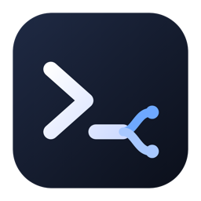

<p align="center"></p>

# os3-router

Use your **Codex / ChatGPT subscription** and/or your **Claude Code** login as the LLM for **rabbit OS3**:
chat, tool calling, workers and computer use. Mix them per role, e.g. `gpt-6-luna` for the main chat and
`claude-sonnet-5` for the workers. It includes a local dashboard, token and limit tracking, a watchdog that
repairs a stuck rabbit-agent, and a menu bar app on macOS.

```
OS3 cloud ──▶ rabbit-agent (your machine) ──▶ os3-router (localhost:11435) ──▶ codex exec / claude -p ──▶ your subscription
```

> ⚠️ **Read first.** This drives the official Codex CLI and/or the official Claude Code CLI, unmodified, with
> **your own** login. Check whether OpenAI's and Anthropic's terms allow using your subscription this way;
> that decision is yours (see [Claude Code](#claude-code) for what we found). Heavy agent use also burns
> through your 5-hour and weekly limits quickly (the dashboard shows both).

> The project was called **codex-os3** before 0.2.0; old links redirect, and existing installs keep working.

## Install

On the machine that runs your OS3 node (rabbit-agent), in a terminal **on that machine** (not over SSH):

**macOS / Linux**
```sh
curl -fsSL https://raw.githubusercontent.com/Nesbesss/os3-router/main/install.sh | bash
```

**Windows (beta: no real OS3 test yet)**
```powershell
irm https://raw.githubusercontent.com/Nesbesss/os3-router/main/install.ps1 | iex
```

The installer:
1. checks Python 3.9+, installs the Codex CLI if needed, and runs `codex login`; if Claude Code is installed, it is detected too
2. checks that the rabbit-agent (OS3 node) is on this machine
3. installs the router as a service (launchd / systemd / Task Scheduler) that starts at login and restarts on crashes
4. installs the menu bar app (macOS) or tray icon (Windows)
5. opens the setup page and **waits until OS3 connects**

Then, in OS3 go to **Settings → API keys**, provider **local**, and enter:

| field | value |
|---|---|
| device | **this machine** (the one you installed on) |
| endpoint | `http://localhost:11435/v1` |
| model id | `gpt-6-luna` (see [Models](#models)) |
| api key | shown by the installer and on the setup page |
| context window (advanced) | `200000` |

**Pick models per role.** OS3's local mode only lets you set one model, but the router knows who is
asking, so you can choose a model for each role in the dashboard (Settings → Models), like OS3's picker
for cloud providers:

| role | used for | default |
|---|---|---|
| **Small** | the main chat you talk to | `gpt-6-luna` · medium |
| **Standard** | workers that carry out tasks (shell, files, computer use) | `gpt-6-sol` · medium |
| **Background** | memory, fact extraction and reply review (frequent, light) | `gpt-6-luna` · low |

The Codex list comes from your Codex account, so new models show up by themselves; Claude models appear
when Claude Code is installed. The dashboard shows token use per role.

**Several nodes?** Install the router on **one** machine, ideally the one that is always on, and
pick it as the LLM device. Tasks still run on every node. No Tailscale, ngrok, or open ports are needed,
because rabbit relays model calls through the rabbit-agent of the device you picked.

## What it does for OS3

Codex is an agent CLI, not a chat API, so the router does a lot of translation:

- **Tool calling** via a strict output schema, with **several calls per turn** (OS3's computer-use
  skill requires "act → wait → screenshot → look" in one turn)
- **Screenshots** go to the model as real images; the newest 2 are attached
- **One Codex session per task** (`codex exec resume`): each turn sends only new events instead of re-reading
  the whole conversation, and the model keeps its own reasoning
- **Call repair and validation** before OS3 sees a call: broken JSON escapes, device names or garbled device ids
  instead of ids, dlam actions sent as script names, missing `feed_image` after a screenshot, and every
  argument checked against OS3's tool schemas and `act.py`'s own parser. Invalid calls go back to the model once
  to be fixed.
- **Self-checks:** a false "tool not available" gets one retry, "done" after computer use gets one
  verify pass, and a screenshot loop gets a nudge. These extra steps can never make a request fail.
- **Hang handling:** no Codex activity for 90 s means the call is killed and retried once
- **Usage limit** shows up in OS3 as a clear message with the reset time, not "something went wrong"
- **Zero-downtime updates:** upgrades swap the worker process while running requests finish
- **Automatic updates:** every hour it checks for a new release, runs that release's tests on your machine,
  and only then switches over (keeps the previous version; off in Settings)

## Dashboard, menu bar app, watchdog

`http://localhost:11435/` (local only; from elsewhere it needs the API key):

- **Dashboard:** 5-hour and weekly limits with reset countdowns, tokens per hour, recent requests
- **Setup:** OS3 values with copy buttons, key rotation, checks, and a "connected" indicator
- **Watchdog:** events and actions, plus a manual rabbit-agent restart
- **Tasks & export:** one row per OS3 task and a **log export** (zip with a report, the timeline and
  router fixes, with secrets redacted), meant for bug reports
- **Settings:** model, effort, watchdog, captures, alert webhook, optional Jev key

**Watchdog.** The rabbit-agent's LLM tunnel can die silently: it still says "connected" and still runs
commands, but OS3's model requests never arrive, and every task fails with *"Local LLM device can't be
reached"*. The watchdog detects this from hard evidence (our reply asked OS3 to run tools, the agent ran them
or aborted the task, and no follow-up request came) and restarts the agent **through its own scheduler**,
so on macOS it keeps its Accessibility and Screen Recording permissions. It acts at most once per stalled reply
and ignores normal waits (`ask_user`, `wait`, workers). It also warns about usage limits and unstable Codex
connections, and can post alerts to a webhook (e.g. `https://ntfy.sh/<topic>`).

**Jev (optional).** With a [TypeSafe](https://typesafe.ai) key, the watchdog also asks Jev for a second
opinion on the ambiguous case ("is this silence normal?"). Jev receives only timings, tool names and agent log
lines, never your messages or screenshots. Rules stay in charge: Jev can only escalate when it is ≥ 90% sure
*and* the hard signals agree.

## Models

The dashboard's model selector lists exactly what **your** Codex account offers (read from Codex's own
model list), so it may differ per account and changes when OpenAI adds models. Typical options:

| model | Codex's description | good for |
|---|---|---|
| `gpt-6-luna` | Fast and affordable model for easier tasks | **Small** (main chat) and **Background**; clean tool calls |
| `gpt-6-sol` | Workhorse model for coding and everyday work | **Standard** (workers): multi-step tasks, computer use |
| `gpt-6-astra` | Frontier intelligence for the most demanding work | hard worker tasks; uses the most of your limit |
| `gpt-5.6-luna` / `gpt-5.6-sol` / `gpt-5.5` | older generations | fallback |

Each model offers its own **effort** levels (from `low` up to `max` or `ultra`); higher is slower and uses
more of your 5-hour and weekly limits. Suggested starting point: Small = `gpt-6-luna` medium,
Standard = `gpt-6-sol` medium, Background = `gpt-6-luna` low.

What we measured with computer use (small sample, your mileage may vary): `gpt-6-luna` occasionally
**misreads digits in screenshots** (226295 → 26295), while `gpt-5.6-luna` read them correctly. If a
worker task depends on exact numbers from the screen, double-check them or use a stronger worker model.

In OS3 itself, the model id you enter (e.g. `gpt-6-luna`) only matters when per-role models are switched
off in the dashboard; then that one model is used for everything. Append an effort to it if you like,
e.g. `gpt-6-sol-high`.

| `claude-sonnet-5` | Claude Code · balanced | **Standard** (workers) |
| `claude-opus-5-5` / `claude-fable-5-1` | Claude Code · most capable | hard worker tasks; uses the most of your limit |
| `claude-haiku-4-5` | Claude Code · fastest | **Background** |

The logo is an original mark (a terminal prompt whose cursor branches into two routes); os3-router is not
affiliated with or endorsed by OpenAI, Anthropic or rabbit.

## Claude Code

Pick a Claude model for any role in Settings → Models. The router then runs the official `claude` CLI
(`claude -p`), unmodified, the way it runs `codex exec`: Claude Code's own tools, MCP servers, hooks and
settings are switched off for these calls, OS3's tools are passed as a schema, screenshots go in as images,
and each task keeps one Claude Code session. The dashboard shows your Claude 5-hour and weekly limits next to
Codex's.

Setup: install Claude Code on the same machine and sign in **in Claude Code itself** (`claude`, then
`/login`). The router never asks for, reads or stores your login; it only starts the `claude` binary.

On the terms: Anthropic's [Claude Code legal page](https://code.claude.com/docs/en/legal-and-compliance)
allows an end user to sign in to the unmodified Claude Code binary with their own subscription, including
where another product runs Claude Code, and Anthropic's support assistant said this setup is allowed
(an AI chatbot, not a binding ruling). It also says
subscription limits assume ordinary, individual use and that Anthropic may enforce its restrictions without
notice. OS3 workers doing a lot of computer use are heavy use: keep an eye on the limits and decide for yourself.
The router does not load your `~/.claude/settings.json`; it uses the login you made in Claude Code. Only an
`ANTHROPIC_API_KEY` in the service's environment would switch it to per-token API billing.

## Troubleshooting

| you see | cause and fix |
|---|---|
| OS3: *"The device is offline or the local endpoint is unreachable"* when saving | the router must run on the **device you selected** in OS3, and the endpoint must be `http://localhost:11435/v1`. Check `os3-router doctor` on that machine. |
| OS3: *"This model did not make a tool call"* when saving | make sure the **API key** field holds the router's key and `os3-router doctor` is all ✓ (an outdated Codex CLI is the usual cause), then save again; the check is a live model call, so an occasional retry is normal |
| OS3: *"Local LLM device can't be reached"* during tasks | the rabbit-agent's tunnel died; the watchdog restarts the agent automatically within ~2 min, or use *Restart rabbit-agent* in the dashboard / menu bar |
| *"Codex / Claude usage limit reached — resets at …"* | your plan's 5-hour or weekly limit; the dashboard shows both per subscription. Use lighter models/effort per role, or move a role to the other subscription |
| installer says *run this in Terminal on the Mac itself* | macOS services started over SSH lose their permissions; run it locally |
| dashboard shows *Codex CLI version* ✗ | `npm i -g @openai/codex@latest` (older CLIs reject the current models) |
| something else | open an issue with `os3-router doctor` output and a log export (dashboard → Tasks & export) |

`os3-router doctor`: `cd ~/.codex-os3/app && python3 -m codex_os3 doctor` (the internal names kept the old name)

## Privacy and security

- The router listens on `127.0.0.1` only by default, and `/v1` always needs the API key
- It stores **metadata** (timings, token counts, tool names), not message contents. "Captures"
  (full requests, including screenshots and anything you typed) are **off** by default.
- History is kept for 7 days (configurable)
- Exports redact keys, tokens and password-like strings
- It never starts services from SSH on macOS (processes started that way lose their permissions)

## Commands

```sh
cd ~/.codex-os3/app && python3 -m codex_os3 <command>
  status | doctor | setup-info | key [--rotate] | reload | update | export <task>
```
Uninstall: `bash install.sh --uninstall [--purge]` · Windows: `install.ps1 -Uninstall [-Purge]`

## Development

```sh
python3 -m unittest discover -s tests                     # offline tests (no Codex calls)
CODEX_OS3_HOME=/tmp/x CODEX_OS3_PORT=11499 python3 -m codex_os3 serve &
CODEX_OS3_HOME=/tmp/x CODEX_OS3_PORT=11499 python3 tests/live_smoke.py --reload   # uses real Codex quota
app/macos/build.sh                                        # menu bar app (Xcode 15+)
```
`bench/` runs real computer-use tasks on a Mac through the router (see `bench/README.md`). It is
expensive in Codex quota; never run it in CI.

## Platform status

| | install / service / upgrade / uninstall | with a real rabbit-agent + OS3 |
|---|---|---|
| **macOS** | ✓ launchd, tested on real Macs | ✓ in daily use (Codex); Claude Code tested live |
| **Linux** | ✓ systemd user service and cron fallback (CI + Docker) | not yet |
| **Windows** | ✓ Task Scheduler (CI on Windows Server) | not yet (beta) |

CI runs the full test suite on macOS, Linux and Windows with Python 3.9 and 3.12, against a fake Codex
CLI (no quota), plus end-to-end installer runs on Linux and Windows.

MIT license.
